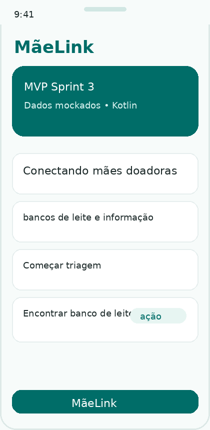
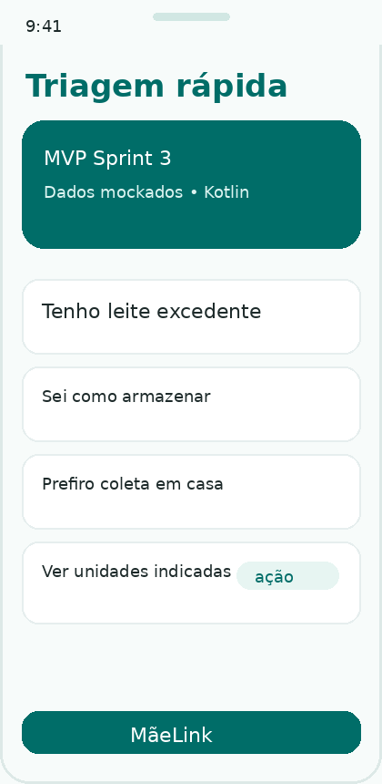
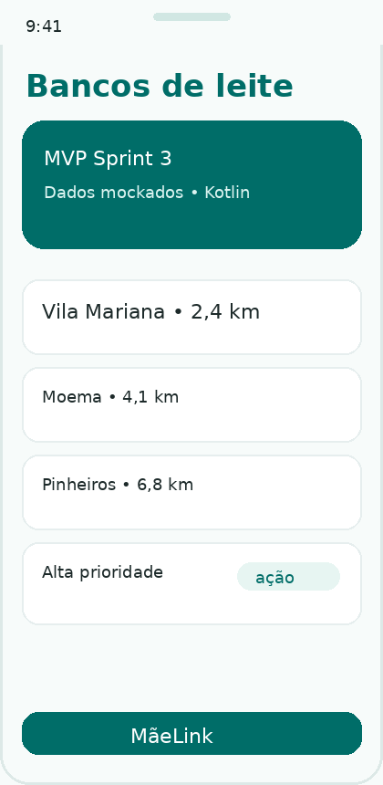
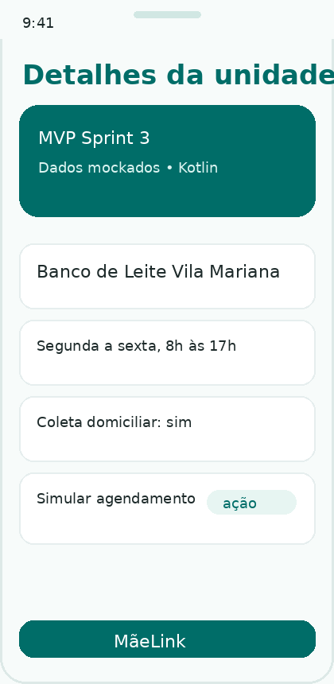
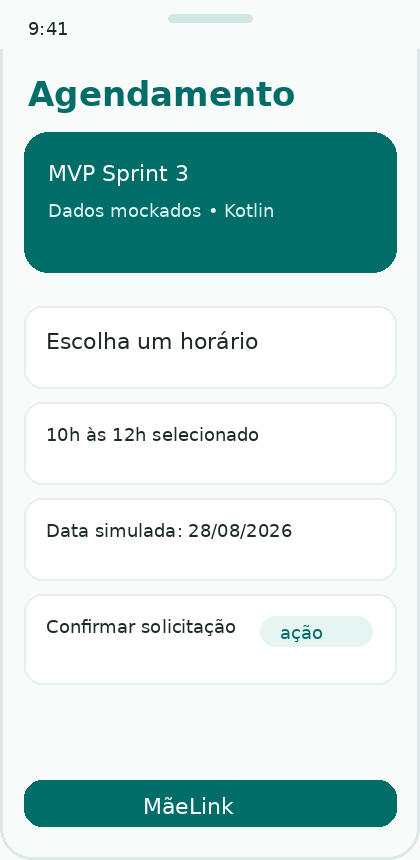
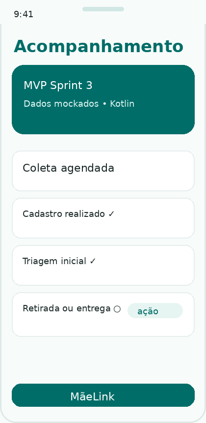
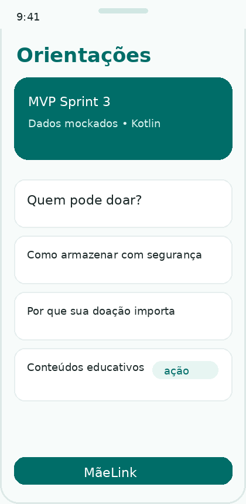

# MãeLink — Android Kotlin Sprint 3

**Projeto:** MãeLink  
**Equipe:** MãeLink  
**Integrante:** João Castro — RM 554628  
**Disciplina:** Android Kotlin Developer  
**Repositório GitHub:** https://github.com/SEU-USUARIO/maelink-android-kotlin

## Objetivo do aplicativo

O MãeLink é um aplicativo Android desenvolvido em Kotlin para aproximar nutrizes, bancos de leite humano e informação confiável. Nesta Sprint 3, o objetivo foi transformar a proposta apresentada nas entregas anteriores em um MVP navegável, com dados mockados e telas conectadas entre si.

A proposta do app é reduzir a distância entre a mãe que pode doar e a unidade que precisa receber o leite, deixando o processo mais simples, claro e acolhedor.

## Funcionalidades implementadas

- Tela inicial de apresentação do MãeLink.
- Triagem rápida da potencial doadora com gerenciamento simples de estado.
- Listagem de bancos de leite com dados mockados realistas.
- Tela de detalhes da unidade selecionada, com passagem de parâmetro pela navegação.
- Simulação de agendamento com escolha de horário.
- Tela de confirmação da solicitação.
- Tela de acompanhamento com linha do tempo da doação.
- Tela de orientações educativas sobre doação e armazenamento.

## Requisitos funcionais escolhidos para a Sprint 3

| Código | Requisito funcional | Implementação no MVP |
|---|---|---|
| RF01 | Apresentar a proposta do aplicativo | Tela inicial com resumo do MãeLink e acesso aos fluxos |
| RF02 | Realizar uma triagem inicial | Tela com perguntas simples e estado em Compose |
| RF03 | Exibir bancos de leite/postos próximos | Lista mockada de unidades com distância, horário e prioridade |
| RF04 | Mostrar detalhes da unidade | Tela de detalhes aberta a partir do item selecionado |
| RF05 | Simular agendamento | Escolha de horário e confirmação da solicitação |
| RF06 | Acompanhar status | Linha do tempo simulada da doação |
| RF07 | Exibir orientações | Conteúdos educativos mockados |

## Justificativa da priorização

A Sprint 3 priorizou as funcionalidades que melhor representam o comportamento central do produto sem depender de API, Firebase, banco local ou backend. O fluxo escolhido permite que a nutriz entenda a proposta, faça uma triagem inicial, encontre uma unidade, simule um atendimento e acompanhe o status da solicitação.

Essas funcionalidades foram escolhidas porque se conectam diretamente ao problema apresentado no pitch: falta de integração entre informação, canais digitais, mães doadoras e bancos de leite humano.

## Dados mockados utilizados

Os dados simulados estão organizados no arquivo:

```text
app/src/main/java/br/com/fiap/maelink/data/MockMaeLinkRepository.kt
```

Foram criados dados mockados para:

- bancos de leite e postos de coleta;
- nível de prioridade de estoque;
- endereço, distância, horário e telefone das unidades;
- disponibilidade de coleta domiciliar;
- conteúdos educativos;
- horários de agendamento;
- status e etapas de acompanhamento da doação.

Os modelos ficam separados no pacote `model`, evitando dados soltos diretamente nas telas.

## Estrutura do projeto

```text
MaeLink_Android_Kotlin_Sprint3_MVP_RM554628/
├── app/
│   └── src/main/java/br/com/fiap/maelink/
│       ├── data/          # dados mockados
│       ├── model/         # classes de dados
│       ├── navigation/    # rotas e NavHost
│       └── ui/
│           ├── components # componentes reutilizáveis
│           ├── screens    # telas do aplicativo
│           └── theme      # cores e tema visual
├── docs/screenshots/      # imagens das principais telas
├── README.md
└── build.gradle.kts
```

## Tecnologias utilizadas

- Kotlin
- Android Studio
- Jetpack Compose
- Material Design 3
- Navigation Compose
- Dados mockados em objetos Kotlin
- Organização por pacotes/camadas

## Prints das principais telas

### 1. Tela inicial

Apresenta a proposta do aplicativo e dá acesso aos principais fluxos: triagem, bancos de leite, conteúdos e acompanhamento.



### 2. Triagem rápida

Simula perguntas iniciais sobre leite excedente, armazenamento e preferência por coleta em casa.



### 3. Bancos de leite próximos

Exibe uma lista de unidades mockadas com distância, horário de atendimento e prioridade de estoque.



### 4. Detalhes da unidade

Mostra informações da unidade selecionada e permite seguir para o agendamento.



### 5. Agendamento

Permite escolher um horário mockado e confirmar a solicitação de atendimento.



### 6. Acompanhamento

Mostra a linha do tempo da solicitação, indicando etapas concluídas e pendentes.



### 7. Orientações

Central de conteúdos educativos sobre quem pode doar, armazenamento e impacto da doação.



## Como executar o projeto

1. Abra o Android Studio.
2. Selecione **Open** e escolha a pasta do projeto `MaeLink_Android_Kotlin_Sprint3_MVP_RM554628`.
3. Aguarde o Gradle sincronizar as dependências.
4. Selecione um emulador Android ou dispositivo físico.
5. Clique em **Run**.

## Versão utilizada como referência

- Android Studio: Koala ou superior.
- Kotlin: 1.9.24.
- Gradle Plugin Android: 8.5.2.
- Compile SDK: 35.
- Min SDK: 26.

## Observações de desenvolvimento

O projeto foi estruturado para ser simples de avaliar e evoluir. A Sprint 3 não utiliza backend, Firebase, API externa ou banco local. A simulação do comportamento do produto foi feita com classes de modelo e listas mockadas em Kotlin, mantendo coerência com a proposta do MãeLink desenvolvida nas entregas anteriores.

## Sugestão de commits para o GitHub

```bash
git init
git add .
git commit -m "chore: criar estrutura inicial do projeto Android"
git add .
git commit -m "feat: implementar telas principais do MaeLink"
git add .
git commit -m "feat: adicionar dados mockados e fluxo de agendamento"
git add .
git commit -m "docs: completar README com prints e instrucoes"
git branch -M main
git remote add origin https://github.com/SEU-USUARIO/maelink-android-kotlin.git
git push -u origin main
```
