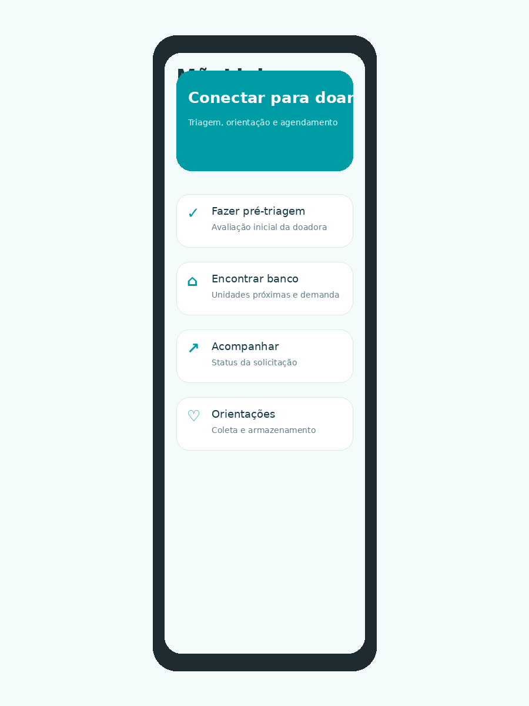
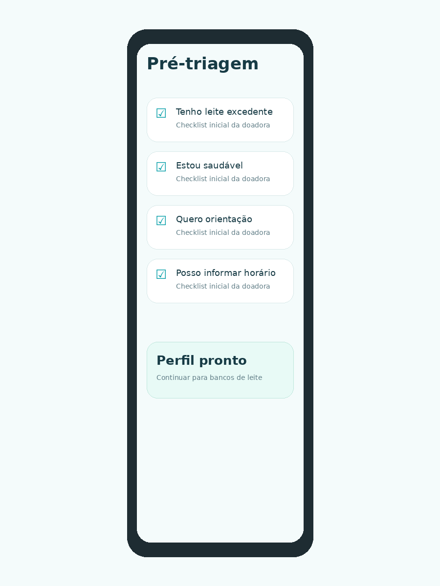
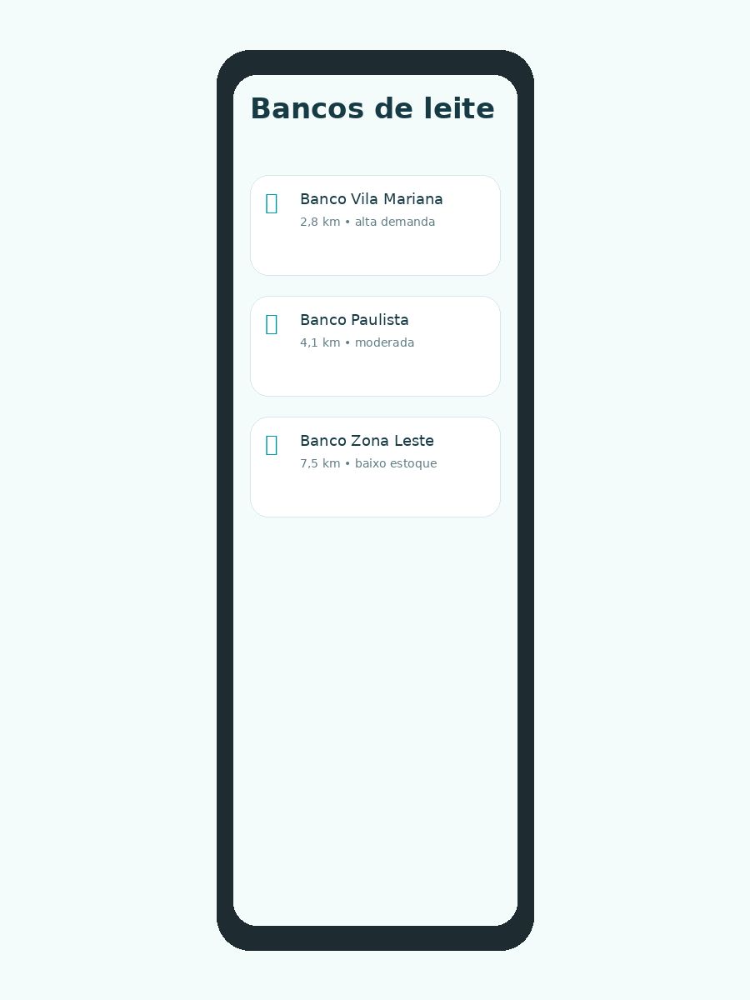
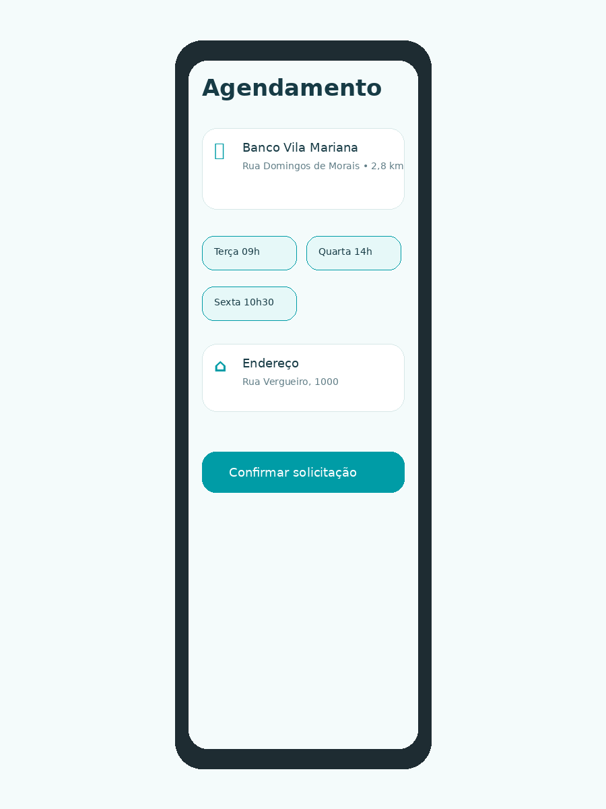
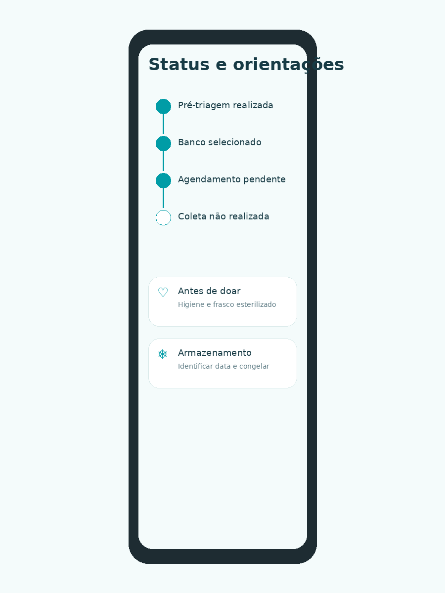

# MãeLink — Flutter Cross Platform Sprint 3

## Identificação do projeto

**Projeto:** MãeLink  
**Equipe:** MãeLink  
**Integrante:** João Castro — RM 554628  
**Disciplina:** Desenvolvimento Cross Platform  
**Repositório GitHub:** https://github.com/JoaoCastro768/maelink-flutter-cross-platform  
**Vídeo de demonstração:** INSERIR_LINK_DO_VIDEO_AQUI

---

## Objetivo do aplicativo

O MãeLink é um aplicativo desenvolvido em Flutter para facilitar a jornada inicial de doação de leite humano. A proposta é aproximar nutrizes, bancos de leite humano e informações confiáveis, criando um fluxo simples para orientação, pré-triagem, escolha de unidade, simulação de agendamento e acompanhamento da solicitação.

Nesta Sprint 3, a ideia apresentada nas entregas anteriores foi transformada em um MVP navegável e demonstrável. O aplicativo não possui integração com API, Firebase, banco de dados local ou backend. O comportamento principal da solução foi simulado com dados mockados organizados no próprio código.

---

## Funcionalidades implementadas

As principais funcionalidades implementadas no MVP foram:

- Tela inicial de apresentação do MãeLink;
- Pré-triagem da potencial doadora;
- Listagem de bancos de leite e postos de coleta;
- Tela de detalhes da unidade selecionada;
- Simulação de agendamento com escolha de horário;
- Tela de confirmação da solicitação;
- Acompanhamento do status da doação;
- Área de orientações educativas sobre doação, coleta e armazenamento.

O foco da entrega foi demonstrar um fluxo coerente de uso, com telas conectadas entre si, botões funcionais, passagem de dados entre telas e informações compatíveis com o contexto de doação de leite humano.

---

## Requisitos funcionais escolhidos para a Sprint 3

| Código | Requisito funcional | Implementação no MVP |
|---|---|---|
| RF01 | Apresentar a proposta do aplicativo | Tela inicial com resumo do MãeLink e botões para os fluxos principais |
| RF02 | Realizar uma pré-triagem inicial | Tela com checklist interativo e controle simples de estado |
| RF03 | Exibir bancos de leite e postos de coleta | Lista mockada com unidades, distância, endereço, demanda e horário |
| RF04 | Mostrar detalhes de uma unidade | Tela aberta a partir do item selecionado na lista |
| RF05 | Simular agendamento de atendimento | Escolha de horário mockado e envio da solicitação |
| RF06 | Exibir confirmação da solicitação | Tela com resumo do banco escolhido, horário e referência de endereço |
| RF07 | Acompanhar o status da doação | Linha do tempo simulando as etapas do processo |
| RF08 | Exibir orientações educativas | Cards informativos sobre cuidados antes da doação, armazenamento e encaminhamento |

---

## Justificativa da priorização

A Sprint 3 priorizou as funcionalidades essenciais para demonstrar o funcionamento do produto sem depender de serviços externos. Em vez de tentar simular um sistema completo de banco de leite, o MVP foi concentrado no fluxo principal da usuária:

1. entender a proposta do MãeLink;
2. responder uma pré-triagem inicial;
3. visualizar unidades disponíveis;
4. abrir o detalhe de uma unidade;
5. escolher um horário de atendimento;
6. receber uma confirmação;
7. acompanhar o andamento da solicitação;
8. acessar orientações educativas.

Essa priorização mantém coerência com o problema trabalhado no pitch: a dificuldade de conectar mães com leite excedente, informação confiável e bancos de leite humano de forma simples e digital.

---

## Dados mockados utilizados

Os dados simulados estão centralizados no arquivo:

```text
lib/data/mock_data.dart
```

Foram criados dados mockados para representar:

- bancos de leite humano e postos de coleta;
- endereço das unidades;
- distância aproximada;
- telefone de contato;
- horário de atendimento;
- nível de demanda por leite humano;
- serviços disponíveis;
- horários para agendamento;
- perguntas da pré-triagem;
- conteúdos educativos;
- etapas de acompanhamento da solicitação.

Os modelos de dados foram separados no pacote `model`, evitando que as informações fiquem espalhadas diretamente nas telas.

---

## Estrutura do projeto

```text
MaeLink_Flutter_Cross_Platform_Sprint3_MVP_RM554628/
├── android/                  # Estrutura Android do projeto Flutter
├── docs/
│   └── screenshots/          # Prints das principais telas do app
├── lib/
│   ├── data/                 # Dados mockados
│   ├── model/                # Classes de modelo
│   ├── navigation/           # Rotas e controle de navegação
│   ├── theme/                # Tema visual e cores
│   └── ui/
│       ├── components/       # Componentes reutilizáveis
│       └── screens/          # Telas principais do aplicativo
├── analysis_options.yaml
├── pubspec.yaml
└── README.md
```

A organização foi pensada para manter separação mínima de responsabilidades, facilitar a leitura do código e permitir evolução nas próximas Sprints.

---

## Tecnologias utilizadas

- Flutter;
- Dart;
- Material Design 3;
- Navegação com rotas nomeadas;
- Widgets componentizados;
- Dados mockados em listas e classes;
- Organização por pacotes e camadas;
- Estrutura preparada para execução em Android.

---

## Prints das principais telas

### 1. Tela inicial

Apresenta a proposta do MãeLink e dá acesso aos principais fluxos do aplicativo: pré-triagem, bancos de leite, acompanhamento e orientações.



---

### 2. Pré-triagem

Simula uma checagem inicial da potencial doadora, com perguntas simples sobre amamentação, saúde, orientação e disponibilidade para contato.



---

### 3. Bancos de leite

Exibe uma lista de unidades mockadas, com distância, endereço, nível de demanda e informações básicas de atendimento. Ao clicar em uma unidade, o app abre a tela de detalhes correspondente.



---

### 4. Detalhe e agendamento

Mostra os dados da unidade escolhida, seus serviços disponíveis e horários simulados para agendamento.



---

### 5. Acompanhamento e orientações

Apresenta uma linha do tempo simulada da solicitação e conteúdos educativos sobre doação, armazenamento e encaminhamento.



---

## Navegação do aplicativo

O projeto utiliza navegação por rotas nomeadas no Flutter.

Fluxo principal implementado:

```text
Tela inicial
 ├── Pré-triagem
 │    └── Bancos de leite
 │         └── Detalhe da unidade
 │              └── Agendamento
 │                   └── Confirmação
 ├── Acompanhamento
 └── Orientações
```

A passagem de dados entre telas aparece principalmente no fluxo de bancos de leite e agendamento. Ao selecionar uma unidade, o aplicativo abre os detalhes correspondentes. Ao escolher um horário, a confirmação recebe os dados do agendamento mockado.

---

## Como executar o projeto

1. Instale o Flutter SDK em versão estável.
2. Abra o projeto no Android Studio ou VS Code.
3. No terminal, execute:

```bash
flutter pub get
```

4. Inicie um emulador Android ou conecte um dispositivo físico.
5. Execute o aplicativo com:

```bash
flutter run
```

---

## Evidência de funcionamento

Além dos prints inseridos neste README, a entrega precisa conter um vídeo curto de navegação do aplicativo mostrando as principais funcionalidades.

Roteiro sugerido para o vídeo:

1. abrir o aplicativo;
2. mostrar a tela inicial;
3. acessar a pré-triagem;
4. seguir para bancos de leite;
5. abrir o detalhe de uma unidade;
6. simular um agendamento;
7. visualizar a confirmação;
8. abrir acompanhamento e orientações.

O link do vídeo deve ser inserido no campo **Vídeo de demonstração** no início deste README antes da entrega final.

---

## Observações de desenvolvimento

O projeto foi desenvolvido como um MVP acadêmico da Sprint 3. O objetivo não foi criar uma solução completa em produção, mas demonstrar uma versão funcional, navegável e coerente com a proposta do MãeLink.

Nesta etapa, não há uso de backend, API, Firebase ou banco de dados local. Todas as informações exibidas foram simuladas com dados mockados organizados em arquivos próprios, mantendo a proposta alinhada às entregas anteriores sobre doação de leite humano.
